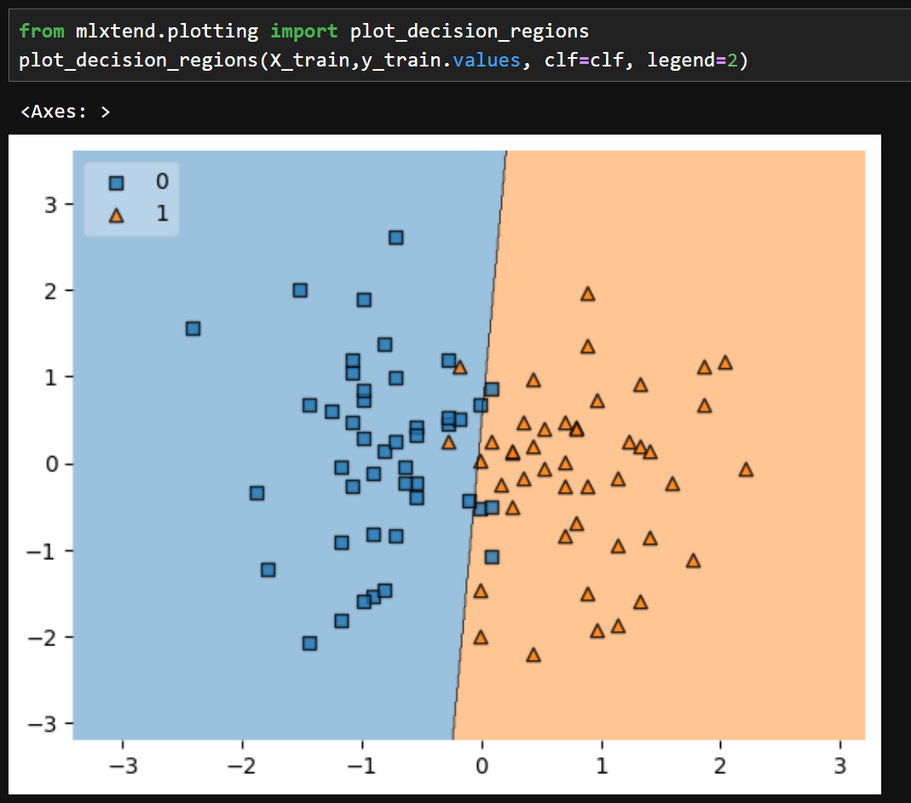

# 📊 Placement Predictor

This project predicts whether a student will get **placed** based on their **IQ** and **GPA**, using **Logistic Regression**.

**Accuracy achieved:** **90%** ✅

---

## 🚀 Project Overview
- Built with **Python** and **Scikit-learn**.  
- Preprocessed the data using **StandardScaler**.  
- Trained a **Logistic Regression** model.  
- Saved the **model** and **scaler** as `.pkl` files for reuse.

---

## 📂 Files in this Repository
- `placement_predictor.ipynb` → Main Jupyter Notebook (training & evaluation).  
- `data.csv` → Dataset used for training/testing.  
- `model.pkl` → Trained Logistic Regression model.  
- `scaler.pkl` → StandardScaler object used for preprocessing.  
- `requirements.txt` → Required dependencies.  
- `README.md` → Project documentation.

---

## ⚙️ Installation

1. Clone this repo:  
```bash
git clone https://github.com/Mukundx1/placement-predictor.git
cd placement-predictor

2. Install the required dependencies:
- pip install -r requirements.txt

3. Run the Jupyter Notebook:
- jupyter notebook placement_predictor.ipynb

```

## 📈 How It Works

- Loads the dataset (data.csv).
- Preprocesses features with StandardScaler.
- Trains a Logistic Regression model on the training set.
- Evaluates performance on the test set (accuracy = 90%).
- Saves both the trained model and scaler as .pkl files for inference.
- Use the saved model + scaler to make predictions on new samples.

---

## 🔮 Example Prediction
```bash
import joblib
import numpy as np

# Load model and scaler
model = joblib.load("model.pkl")
scaler = joblib.load("scaler.pkl")

# Example: Student with GPA=8.5, IQ=120
student = np.array([[8.5, 120]])
student_scaled = scaler.transform(student)

prediction = model.predict(student_scaled)
print("Placed" if prediction[0] == 1 else "Not Placed")
```
---

## 📊 Results & Visualization

The Logistic Regression model achieved **90% accuracy** on the test data.  
Below is the decision boundary visualization:




- Blue region → Not Placed (0)  
- Orange region → Placed (1)  
- Squares → Training samples labeled "Not Placed"  
- Triangles → Training samples labeled "Placed"  

---


## 🛠️ Tech Stack

- Python 3.x
- Pandas (data manipulation)
- NumPy (numerical operations)
- Scikit-learn (LogisticRegression, StandardScaler, train_test_split, joblib)
- Matplotlib / Seaborn (visualizations)
- Jupyter Notebook (development & demonstration
